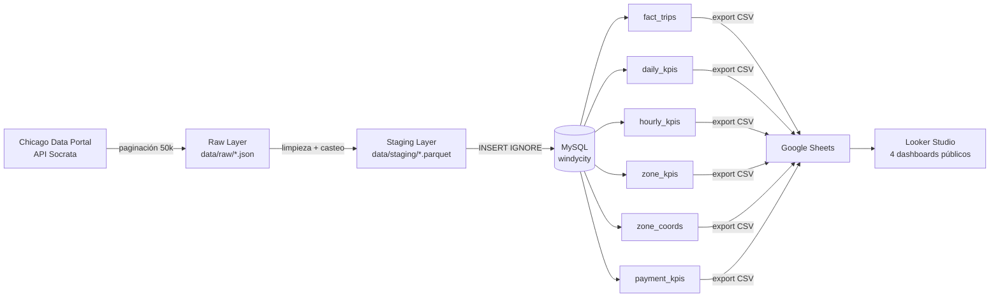

# WindyCity Cabs — Senior Data Engineer Challenge

Pipeline end-to-end de datos de taxis de Chicago: ingesta incremental desde API pública → raw → staging → modelo analítico en MySQL → dashboards públicos en Looker Studio.

---

## Índice

1. [Arquitectura del pipeline](#arquitectura-del-pipeline)
2. [Requisitos previos](#requisitos-previos)
3. [Cómo ejecutar el proyecto (end-to-end)](#cómo-ejecutar-el-proyecto-end-to-end)
4. [Estructura del repositorio](#estructura-del-repositorio)
5. [Decisiones y trade-offs](#decisiones-y-trade-offs)
6. [Modelo analítico](#modelo-analítico)
7. [Métricas de negocio](#métricas-de-negocio)
8. [Dashboards](#dashboards)
9. [Calidad de datos](#calidad-de-datos)
10. [Bonus implementados](#bonus-implementados)
11. [Backlog](#backlog)
12. [Uso de IA](#uso-de-ia)

---

## Arquitectura del pipeline



---

## Requisitos previos

- Python 3.10+
- Docker Desktop
- Git

---

## Cómo ejecutar el proyecto (end-to-end)

### 1. Clonar el repositorio

```bash
git clone https://github.com/ialetelierch/passline.git
cd passline
```

### 2. Instalar dependencias Python

```bash
pip install -r requirements.txt
```

### 3. Configurar variables de entorno

```bash
cp .env.example .env
```

El `.env.example` ya incluye los valores listos para usar — no es necesario editar nada. Si querés cambiar las credenciales de MySQL, asegurate de que coincidan con las del paso siguiente.

> **Nota Windows:** el host `127.0.0.1` (en vez de `localhost`) es necesario para forzar conexión TCP/IP con el MySQL Connector. El puerto `3307` evita conflicto si ya tenés MySQL instalado localmente (que ocupa el `3306`).

### 4. Levantar MySQL con Docker

```bash
docker run -d --name windycity-mysql \
  -e MYSQL_ROOT_PASSWORD=windycity123 \
  -e MYSQL_DATABASE=windycity \
  -e MYSQL_USER=wc_user \
  -e MYSQL_PASSWORD=wc_pass123 \
  -p 3307:3306 \
  mysql:8.0
```

Las credenciales del comando coinciden con las del `.env.example`. Verificar que el contenedor está corriendo:

```bash
docker ps | grep windycity-mysql
```

### 5. Ejecutar el pipeline completo

**Opción rápida (recomendada):**

```bash
make run
```

Ejecuta todos los pasos del pipeline en orden: schema → ingesta → staging → carga → calidad → exportación. Tiempo estimado: ~15 minutos (la ingesta de ~966k registros tarda ~8 minutos).

**Paso a paso (referencia):**

```bash
python db/schema.py          # Crea las tablas en MySQL
python ingestion/ingest.py   # Descarga raw desde la API (~8 min, ~20 requests)
python ingestion/staging.py  # Transforma raw → Parquet tipado
python db/load.py            # Carga staging → MySQL
python quality/checks.py     # Ejecuta 7 checks — genera quality/report.json
python exports/export.py     # Exporta tablas KPI a CSV en exports/
```

Cada paso también tiene su propio target en el Makefile: `make schema`, `make ingest`, `make staging`, `make load`, `make quality`, `make export`.

---

## Estructura del repositorio

```
passline/
├── ingestion/
│   ├── ingest.py          # Descarga API → raw (JSON paginado)
│   ├── staging.py         # Transforma raw → staging (Parquet tipado)
│   └── watermark.json     # Estado incremental (generado automáticamente)
├── db/
│   ├── schema.py          # Crea las tablas en MySQL
│   └── load.py            # Carga staging → MySQL
├── quality/
│   ├── checks.py          # Data quality checks automáticos
│   └── report.json        # Reporte generado (generado automáticamente)
├── exports/
│   ├── export.py          # Exporta tablas agregadas a CSV
│   ├── daily_kpis.csv
│   ├── hourly_kpis.csv
│   ├── zone_kpis.csv
│   ├── zone_coords.csv
│   └── payment_kpis.csv
├── data/
│   ├── raw/               # JSON paginados desde la API (gitignored)
│   └── staging/           # Parquet limpio y tipado (gitignored)
├── Makefile               # Orquestación del pipeline completo
├── requirements.txt
├── .env.example
├── .gitignore
└── README.md
```

---

## Decisiones y trade-offs

### Fuente de datos

- **Dataset:** Chicago Taxi Trips 2024 — ID `ajtu-isnz`, Socrata API
- **Ventana seleccionada:** `2025-12-03` → `2026-01-31` (60 días)
- **Motivo del rango:** se consultó el `max(trip_start_timestamp)` directamente a la API antes de definir la ventana, en lugar de asumir que los datos llegan hasta hoy. El último dato disponible es `2026-02-01`, pero ese día tiene solo 28 registros (dato incompleto por lag de la fuente), por lo que se excluyó. La ventana de 60 días ofrece suficiente estacionalidad semanal y cubre dos períodos festivos relevantes (Navidad y Año Nuevo).
- **Lag de la fuente:** el dataset tiene un lag de ~2 semanas entre que ocurre el viaje y que aparece en la API. Esto es propio de reportes municipales y se documenta como limitación en los dashboards.

### Ingesta incremental

- **Estrategia de watermark:** se persiste la última `trip_start_timestamp` procesada en `watermark.json`. En cada ejecución incremental se consulta solo lo nuevo desde ese punto.
- **Idempotencia:** se usa `INSERT IGNORE` en MySQL sobre la clave primaria `trip_id`. Re-ejecutar el pipeline no duplica registros.
- **Paginación:** 50,000 registros por request (límite de Socrata). La carga inicial requirió ~20 requests. Las cargas incrementales diarias son ~1 request (~16,000 registros/día).

### Campos descartados

| Campo | Motivo |
|---|---|
| `pickup_centroid_location` | Objeto GeoJSON redundante — lat/lon ya vienen como campos separados |
| `dropoff_centroid_location` | Ídem |

Todos los demás campos del dataset se preservan en raw y staging para decidir su uso en el modelo analítico.

### Tipos de datos

Todos los campos numéricos llegan como `string` desde la API (`"fare": "22.25"`). El proceso de staging castea a los tipos correctos:

| Campo | Tipo en staging |
|---|---|
| `trip_seconds` | INT |
| `trip_miles` | FLOAT |
| `fare`, `tips`, `tolls`, `extras`, `trip_total` | DECIMAL(10,2) |
| `pickup_community_area`, `dropoff_community_area` | INT |
| `pickup/dropoff_centroid_latitude/longitude` | FLOAT |
| `trip_start_timestamp`, `trip_end_timestamp` | DATETIME |

### Compatibilidad Windows con MySQL Connector

En Windows, `mysql-connector-python` intenta conectarse por named pipe cuando el host es `localhost`. Para forzar TCP/IP se usa `use_pure=True` y `host=127.0.0.1` en todos los scripts de base de datos. Esto es transparente para el usuario final pero importante para reproducibilidad en entornos Windows.

### Modelo analítico — Opción 2 (MVP con tablas agregadas)

Se eligió tablas agregadas para BI por sobre el star schema completo porque:
- Reduce drásticamente el tiempo de respuesta en Looker Studio
- Es suficiente para responder todas las preguntas de negocio definidas
- Simplifica la conexión con Google Sheets como capa intermedia sin necesidad de exponer MySQL públicamente

---

## Modelo analítico

### Tablas

| Tabla | Grain | Descripción |
|---|---|---|
| `fact_trips` | 1 fila = 1 viaje | Todos los viajes limpios y tipados |
| `daily_kpis` | 1 fila = 1 día | Revenue, viajes, tips, distancia agregados por día |
| `hourly_kpis` | 1 fila = día + hora | Volumen y revenue por hora del día |
| `zone_kpis` | 1 fila = zona de pickup | Métricas por community area de origen |
| `payment_kpis` | 1 fila = día + tipo de pago | Mix de métodos de pago por día |

### Campos derivados en fact_trips

| Campo | Descripción |
|---|---|
| `trip_hour` | Hora del día extraída de `trip_start_timestamp` |
| `trip_weekday` | Día de la semana (0=Lunes, 6=Domingo) |
| `trip_date` | Fecha sin hora |
| `revenue_per_mile` | `trip_total / trip_miles` |
| `tip_rate` | `tips / fare` (cuando fare > 0) |
| `is_outlier` | Flag: viaje > 3 horas O > 100 millas O fare negativo |

---

## Métricas de negocio

### Preguntas que responde este data product

1. **¿Cómo evoluciona el revenue a lo largo del tiempo?** — tendencias, estacionalidad y correlación con volumen de viajes y taxis activos. → *Dashboard 1*
2. **¿En qué horas y días de la semana hay más demanda?** — identificar picos operativos para optimizar turnos y despacho. → *Dashboard 2*
3. **¿Qué empresas y métodos de pago concentran el negocio?** — entender el mix de mercado y comportamiento de pago. → *Dashboard 3*
4. **¿Desde dónde y hacia dónde viajan los pasajeros?** — identificar zonas de alta demanda para orientar la flota. → *Dashboard 4*

### Métricas definidas

**M1 — Total Revenue**
- **Definición:** suma del ingreso total de todos los viajes en el período
- **Cálculo:** `SUM(trip_total) WHERE is_outlier = 0`
- **Por qué importa:** KPI financiero principal; permite detectar caídas, tendencias y comparar períodos

**M2 — Total Trips**
- **Definición:** cantidad de viajes realizados en el período
- **Cálculo:** `COUNT(trip_id) WHERE is_outlier = 0`
- **Por qué importa:** mide el volumen operativo; combinado con revenue indica si bajan precios o demanda

**M3 — Ticket Promedio (avg_fare)**
- **Definición:** tarifa base promedio por viaje, sin propinas ni extras
- **Cálculo:** `AVG(fare) WHERE is_outlier = 0`
- **Por qué importa:** permite comparar rentabilidad por zona y horario independientemente del volumen

**M4 — Taxis Activos (active_taxis)**
- **Definición:** cantidad de taxis únicos que operaron en el período
- **Cálculo:** `COUNT(DISTINCT taxi_id)`
- **Por qué importa:** mide la capacidad operativa real de la flota; cae en feriados y mal tiempo

**M5 — Viajes por Hora del Día**
- **Definición:** distribución del volumen de viajes según la hora de inicio
- **Cálculo:** `SUM(total_trips) GROUP BY trip_hour`
- **Por qué importa:** identifica horas pico para planificar turnos y asignación de unidades

**M6 — Viajes por Día de la Semana**
- **Definición:** distribución del volumen según el día de la semana
- **Cálculo:** `SUM(total_trips) GROUP BY trip_weekday`
- **Por qué importa:** muestra patrones semanales que guían la planificación operativa semanal

**M7 — Mix de Tipo de Pago**
- **Definición:** distribución porcentual de viajes y revenue por método de pago
- **Cálculo:** `SUM(total_trips) / SUM(total_trips) GROUP BY payment_type`
- **Por qué importa:** Mobile y Credit Card dominan; Cash implica riesgo de cobranza y menor propina

**M8 — Revenue por Empresa**
- **Definición:** revenue total generado por cada compañía de taxis
- **Cálculo:** `SUM(total_revenue) GROUP BY company`
- **Por qué importa:** Flash Cab concentra la mayor parte del mercado; permite comparar desempeño entre empresas

**M9 — Revenue por Zona de Pickup**
- **Definición:** revenue total generado según la community area de origen del viaje
- **Cálculo:** `SUM(total_revenue) GROUP BY pickup_community_area`
- **Por qué importa:** identifica zonas de alta rentabilidad donde conviene concentrar la flota

**M10 — Viajes por Zona de Dropoff**
- **Definición:** cantidad de viajes que terminan en cada community area
- **Cálculo:** `SUM(total_trips) GROUP BY dropoff_community_area`
- **Por qué importa:** zonas con muchos dropoffs pero pocos pickups son zonas donde los taxis quedan vacíos

**M11 — Total de Propinas (total_tips)**
- **Definición:** suma de propinas recibidas en el período
- **Cálculo:** `SUM(tips) WHERE is_outlier = 0`
- **Por qué importa:** complementa el revenue; pagos digitales generan consistentemente más propinas que efectivo

**M12 — Outlier Rate**
- **Definición:** porcentaje de viajes marcados como anómalos sobre el total
- **Cálculo:** `COUNT(is_outlier=1) / COUNT(*) * 100`
- **Por qué importa:** controla la calidad del dato; un aumento repentino puede indicar problemas en la fuente
---

## Dashboards

Los 4 dashboards están disponibles públicamente en Looker Studio (sin login):

| # | Nombre | Audiencia | Link |
|---|---|---|---|
| 1 | Revenue Overview | Dirección / CEO / CFO | [🔗 Ver dashboard](https://lookerstudio.google.com/s/o52uUkD0Z94) |
| 2 | Análisis por hora y día de la semana | Ops Manager / Despachadores | [🔗 Ver dashboard](https://lookerstudio.google.com/s/izNWAb1VmMQ) |
| 3 | Participación por compañía y tipo de pago | CFO / Analistas Financieros | [🔗 Ver dashboard](https://lookerstudio.google.com/s/uRRdb7K8--s) |
| 4 | Análisis geográfico pickup y dropoff | Ops Manager / Expansión | [🔗 Ver dashboard](https://lookerstudio.google.com/s/mYYtH561gZU) |

### Dashboard #1 — Revenue Overview
- **Propósito:** visión ejecutiva del negocio en el período
- **Audiencia:** CEO, CFO, Dirección general
- **Visualizaciones:** scorecards (revenue, trips, taxis activos, tiempo total, propinas), series de tiempo de revenue / ticket promedio / taxis activos, barras apiladas de componentes del revenue (fare, tips, extras, tolls) en valores absolutos y porcentuales, scatter plots de correlación entre revenue y variables operativas
- **Decisiones que habilita:** detectar caídas de revenue, entender qué impulsa el ticket promedio, comparar composición del ingreso día a día
- **Fuente:** `daily_kpis`
- **Limitaciones:** lag de ~2 semanas en los datos; el día más reciente puede estar incompleto

### Dashboard #2 — Análisis por hora y día de la semana
- **Propósito:** planificación operativa de turnos y despacho
- **Audiencia:** Ops Manager, coordinadores de turno
- **Visualizaciones:** tabla pivot con heatmap de % de viajes por hora × día de la semana, barras de total trips por hora del día, barras de total trips por día de la semana
- **Decisiones que habilita:** optimizar asignación de unidades según franja horaria y día, identificar horas valle donde sobran taxis
- **Fuente:** `hourly_kpis`
- **Limitaciones:** los timestamps de la API están redondeados a 15 min, no son exactos al minuto

### Dashboard #3 — Participación por compañía y tipo de pago
- **Propósito:** análisis del mix de mercado y comportamiento de cobranza
- **Audiencia:** CFO, analistas financieros
- **Visualizaciones:** treemaps de trips y revenue por tipo de pago, treemap de revenue por empresa, barras 100% apiladas de mix de pago por empresa
- **Decisiones que habilita:** identificar empresas con mayor dependencia de cash (riesgo de cobranza), evaluar adopción de pagos digitales por empresa, detectar concentración de mercado
- **Fuente:** `payment_kpis`
- **Limitaciones:** el campo `company` no está normalizado; algunas empresas aparecen con nombres ligeramente distintos

### Dashboard #4 — Análisis geográfico pickup y dropoff
- **Propósito:** identificar zonas de alta demanda para orientar la flota
- **Audiencia:** Ops Manager, equipo de expansión
- **Visualizaciones:** 4 mapas de burbujas sobre Chicago — revenue por zona de pickup, trips por zona de pickup, revenue por zona de dropoff, trips por zona de dropoff
- **Decisiones que habilita:** concentrar flota en zonas de alta demanda, identificar zonas generadoras vs receptoras de pasajeros, detectar zonas con alto revenue pero bajo volumen (tickets altos)
- **Fuente:** `zone_kpis` + `zone_coords` (coordenadas promedio calculadas desde fact_trips)
- **Limitaciones:** las coordenadas son promedios por community area, no puntos exactos; O'Hare aparece como outlier dominante por su alto volumen
---

## Calidad de datos

Se implementaron 7 checks automáticos en `quality/checks.py`. Resultados sobre 965,793 registros:

| Check | Resultado | Detalle |
|---|---|---|
| Nulos en campos clave | ❌ 1,113 nulos en `fare` | Dato faltante en la fuente, no error del pipeline. Excluidos de KPIs agregados |
| Valores negativos | ✅ 0 negativos | Sin problemas |
| Unicidad `trip_id` | ✅ 0 duplicados | 965,793 únicos |
| Coherencia temporal | ⚠️ 1 viaje con end < start | Flagueado como `is_outlier`, manejado |
| Outliers | ✅ 975 (0.101%) | 914 viajes > 3h, 77 viajes > 100 millas, 1 temporal |
| Consistencia de totales | ⚠️ 563,137 diferencias > $0.10 | Informativo, no bloqueante — ver nota |
| Rango de fechas | ✅ 2025-12-03 → 2026-01-31 | Ventana correcta |

**5/7 checks pasaron. Los 2 restantes son advertencias informativas, no errores bloqueantes.**

### Nota sobre consistencia de totales

Al investigar las diferencias entre `trip_total` y `fare + tips + tolls + extras`, encontramos que la distribución de diferencias es sistemática (~$0.50 en la mayoría de casos), lo que apunta al **Chicago Citywide Surcharge** de $0.50 por viaje. Sin embargo, la investigación mostró que el surcharge no aplica uniformemente a todos los viajes — varía según tipo de viaje, empresa y período.

**Conclusión:** el campo `trip_total` incluye componentes adicionales (surcharges municipales, cargos especiales) que el dataset público no desglosa en campos separados. No es un error del pipeline sino una limitación de la fuente de datos. El check se mantiene como advertencia informativa.

---

## Bonus implementados

- ✅ **Orquestación liviana con Makefile** — `make run` ejecuta el pipeline completo end-to-end; targets individuales disponibles por paso
- ⬜ Tests automáticos + CI
- ⬜ Observabilidad (row counts, runtime, data freshness)
- ⬜ Data dictionary formal
- ⬜ Alertas por anomalías

---

## Backlog

Qué haría en una siguiente iteración con más tiempo:

| Ítem | Prioridad | Motivo |
|---|---|---|
| Tests automáticos con pytest | Alta | Garantizar que la ingesta no rompe silenciosamente |
| Observabilidad: row counts + runtime por ejecución | Alta | Detectar degradación del pipeline en producción |
| Star schema completo con dimensiones | Media | Más flexible para análisis ad-hoc |
| Alertas por anomalías en revenue diario | Media | Notificar caídas > 20% respecto al promedio móvil |
| Modelo estadístico de outliers (IQR/Z-score) | Media | Más robusto que las reglas heurísticas actuales |
| Orquestación con Prefect/Airflow | Baja | Para producción real; el Makefile es suficiente para MVP |
| Data dictionary formal | Baja | Útil para equipos grandes, no crítico en MVP |

---

## Uso de IA

Se utilizó **Claude (Anthropic)** como asistente principal durante todo el desarrollo, tanto en la interfaz web claude.ai como en Claude Code (extensión VS Code).

### Influencia por área

| Área | Influencia de IA |
|---|---|
| Exploración de la API | Alta — análisis de respuestas y decisiones sobre campos |
| Diseño del pipeline | Alta — estructura de capas, estrategia de watermark |
| Código Python (ingesta) | Alta — generación del script base |
| Schema MySQL | Alta — definición de tablas y tipos |
| Definición de métricas | Media — propuestas revisadas y ajustadas manualmente |
| Documentación (README) | Alta — redacción del borrador base |
| Dashboards en Looker Studio | Baja — diseño y configuración manual |

### Prompts relevantes utilizados

**Exploración de la API antes de escribir código:**
```
Antes de definir la ventana de 60 días, consultar el max(trip_start_timestamp) 
directamente a la API para no asumir que los datos llegan hasta hoy — 
la página de metadata dice que fue actualizado el 13 de febrero pero 
¿cómo sabemos que los datos están actualizados hasta hoy?
```

**Generación del script de ingesta:**
```
Crea un script Python de ingesta con las siguientes características:
- Ventana: 2025-12-03 al 2026-01-31 (excluir 2026-02-01 por dato incompleto, 
  solo 28 registros)
- Total esperado: ~965k registros
- Paginación: 50,000 por request (~20 requests para carga inicial)
- Watermark: por trip_start_timestamp, granularidad diaria, 
  persistido en watermark.json
- Campos a descartar: pickup_centroid_location y dropoff_centroid_location 
  (GeoJSON redundante con lat/lon ya disponibles como campos separados)
- Todos los numéricos vienen como string desde la API → castear en staging
- Mostrar progreso por página en pantalla
- Guardar raw como JSON paginado y staging como Parquet tipado
```

**Diseño del modelo analítico:**
```
Usar Opción 2 (MVP con tablas agregadas) por sobre star schema completo.
Tablas necesarias: fact_trips, daily_kpis, hourly_kpis, zone_kpis, payment_kpis.
Justificación: más rápido para BI, suficiente para responder las preguntas 
de negocio, y evita exponer MySQL públicamente usando Google Sheets como 
capa intermedia.
```

> **Nota importante:** todas las decisiones técnicas (ventana de fechas, campos descartados, estrategia de watermark, elección del modelo analítico) fueron razonadas y validadas antes de ser implementadas. El autor puede explicar y defender cada una de estas decisiones en detalle sin asistencia de IA.
